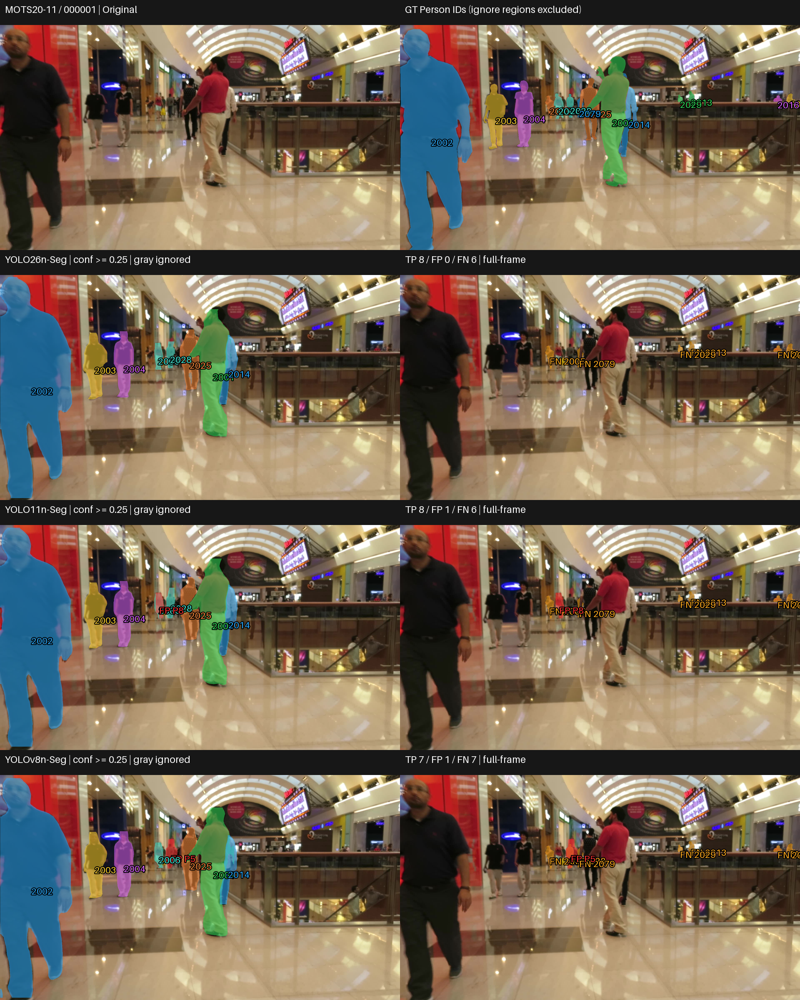
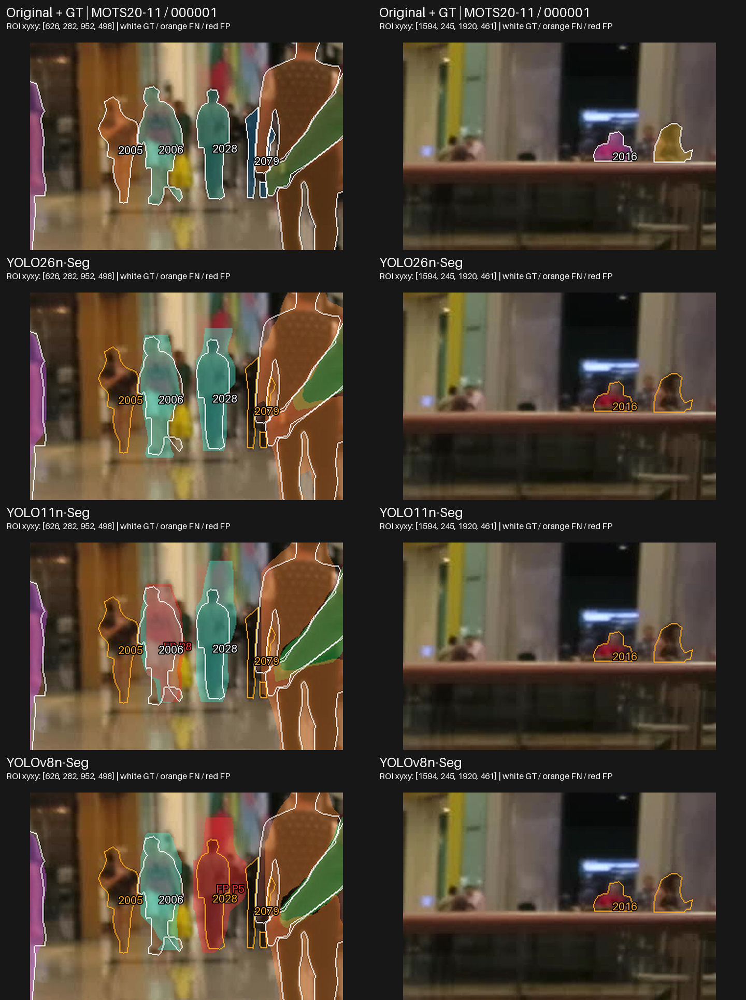
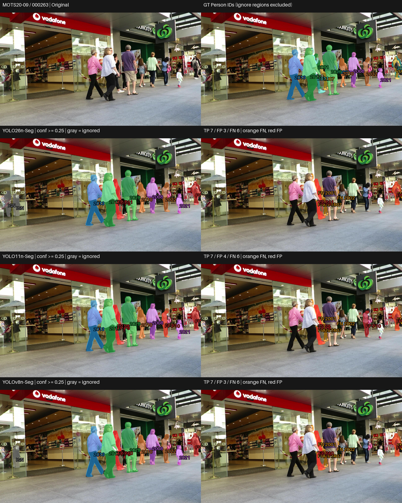
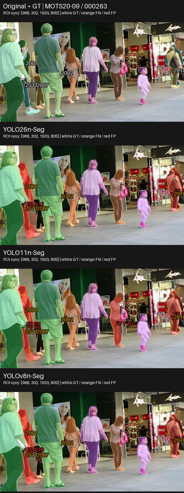
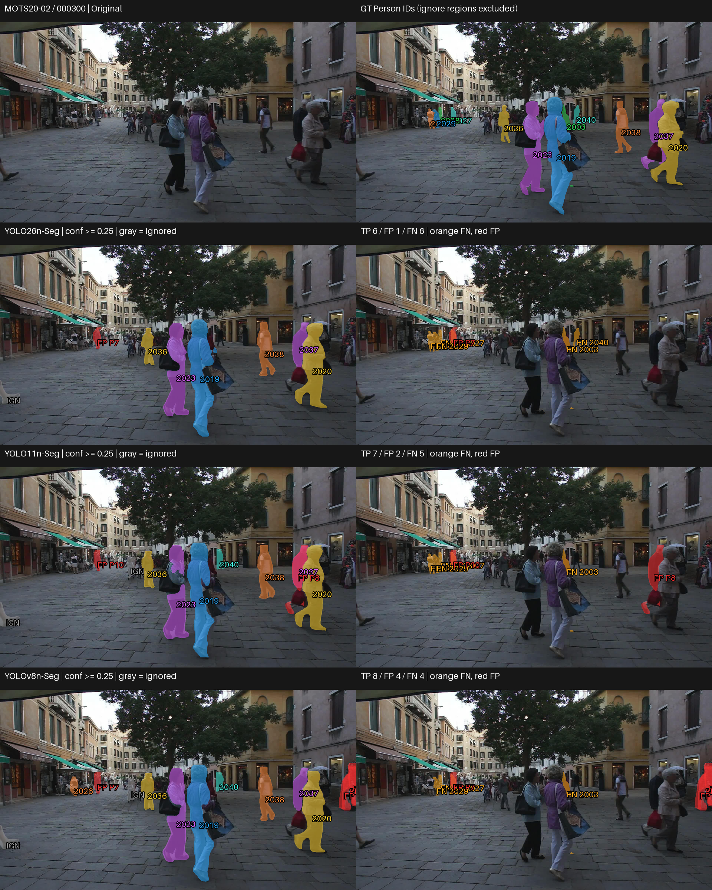
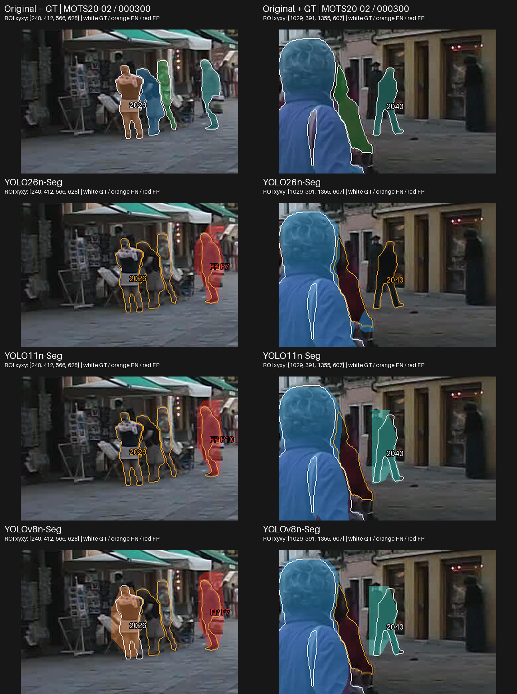
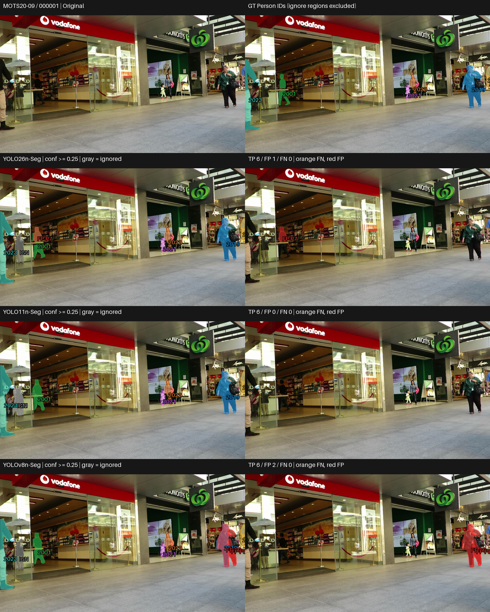
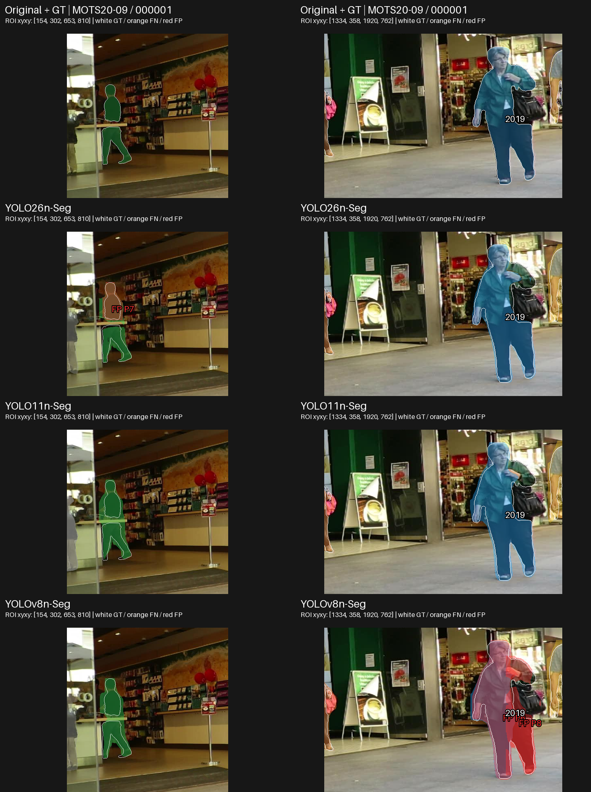

# Nano (N) — Visual and Qualitative Analysis

## 1. ภาพรวมผลการทดลอง

Nano ทดสอบครบ 3 pretrained models บน MOTS20 2,862 เฟรม / 26,894 Person GT instances โดยไม่ fine-tune และใช้ frozen protocol เดิม เอกสารนี้อ่านพฤติกรรมจาก prediction จริง; ผลเชิงตัวเลขเต็มอยู่ที่ [RESULTS_SUMMARY_TH.md](RESULTS_SUMMARY_TH.md)

| Model | Mask mAP50-95 | AP75 | Recall |
|---|---|---|---|
| YOLO26n-Seg | 0.472698 | 0.506766 | 0.687068 |
| YOLO11n-Seg | 0.431929 | 0.450826 | 0.693798 |
| YOLOv8n-Seg | 0.423062 | 0.439115 | 0.696921 |

## การเลือกกรณีและการอ่านภาพ

คัด 4 กรณีจาก 12 frozen visualization frames ด้วย per-frame TP/FP/FN และตรวจ original/GT กับ saved masks เลือก 1 shared anchor (Case 2: MOTS20-09 / 000263) และอีก 3 diagnostic cases ตามพฤติกรรมของ Nano มีทั้งข้อได้เปรียบ ข้อผิดพลาดร่วม กรณีสวนอันดับ และผลคล้ายกัน ไม่ใช่ representative sample
ภายใน case ใช้เฟรมเดียวกันครบทุกโมเดล ระหว่าง tier ไม่บังคับให้ทุกภาพเหมือนกัน แต่ซ้ำได้เมื่อมีเหตุผล ชุดใหม่รวม 20 case slots จาก original frames ต่างกัน 10 เฟรม (เดิม 6) และเพิ่ม MOTS20-11 ภาพซ้ำไม่เพิ่มจำนวนตัวอย่างอิสระ รายละเอียดอยู่ใน [CASE_SELECTION.md](outputs/visualizations/qualitative/selection_v2/CASE_SELECTION.md)
ไม่มี comparison เดิม จึงสร้างจาก saved lossless RLE และ original/GT ไม่โหลดโมเดลและไม่รัน inference เพิ่ม

แถวแรก Original/GT; ต่อด้วย YOLO26, YOLO11, YOLOv8 ซ้าย prediction ขวา unmatched overlay ใช้ภาพเต็มเฟรมเดียวกันและ scale เท่ากัน สี matched mask ผูกกับ GT ID; สีส้ม FN สีแดง FP สีเทา IGN
ใช้ confidence ≥0.25, matching mask IoU ≥0.50 และ ignore IOA เดิม FN คือ GT ไม่มีคู่ผ่านเกณฑ์ จึงอาจมี detection ที่ mask ไม่ผ่าน IoU; FP คือ prediction ไม่ match valid GT และไม่ถูก ignore จึงอาจอยู่บนคนจริง GT panel แสดง Person; IGN ไม่ถูกนับ FP ตัวเลขตรวจตรงกับ per-frame CSV

### Case เหล่านี้ช่วยตัดสินใจอย่างไร

ชุดนี้ใช้ประกอบการเลือกด้านความครบถ้วนของ instance และ unmatched output โดยอ่านร่วมกับ canonical metrics ไม่ได้ให้ผู้ชนะทุกภาพหรือใช้วัด latency/VRAM Case 2 เป็นเฟรมร่วมเพื่อเทียบข้อจำกัดบน source เดียวกัน อีก 3 cases เลือกตามพฤติกรรมของ tier; หากเฟรม diagnostic ตรงกับ tier อื่น เหตุผลต้องอยู่ใน CASE_SELECTION.md และไม่นับเป็นหลักฐานอิสระเพิ่ม 4 cases ไม่แทน 2,862 เฟรม

| Case | Pain point / บทบาท | ใช้ประกอบการเลือกด้านใด |
|---|---|---|
| 1 | จำแนกโมเดล / extra output: GT 2028 ที่พลาดใน YOLOv8n และ mask เพิ่มบน GT 2006 | ใช้เทียบการเก็บ GT 2028 กับภาระ extra masks: YOLO26n/YOLO11n มี TP 8 และ FN ชุดเดียวกัน แต่ YOLO11n มี FP บน GT 2006 ที่มีคู่แล้ว; YOLOv8n มี TP 7 |
| 2 | ข้อจำกัดร่วม: FN ชุดเดียวกันหก GT และ unmatched masks | ใช้แสดงข้อจำกัดร่วมและภาระตรวจ unmatched output เมื่อคนซ้อนกัน ไม่ใช่ case ที่ counts ให้ผู้ชนะชัด |
| 3 | TP–FP trade-off: GT 2026/2040 และ FP เพิ่ม | ช่วยเลือกตาม priority: YOLOv8n เก็บ GT เพิ่ม แต่ FP มากขึ้น; สอดคล้องในทิศทางกับ Recall สูง/Precision ต่ำใน dataset |
| 4 | extra mask บนคนจริง: unmatched masks ทับ GT ที่มีคู่แล้ว | เป็น pain point ด้าน extra-instance output: ทุกโมเดลมี TP 6 / FN 0 แต่ YOLO26n มี mask เพิ่มทับ GT 2001 และ YOLOv8n มีสอง mask เพิ่มทับ GT 2019; YOLO11n ไม่มี FP |

ภาพขยายเป็น ROI เพิ่มเติมจาก original frames และ saved masks แถวแรก Original/GT ต่อด้วยโมเดลตามลำดับเดิม แต่ละคอลัมน์ใช้พิกัด/scale เดียวกันทุกโมเดล แถว Original/GT ใช้เส้นขาวแสดง valid GT; ในแถวโมเดลเส้นขาวคือ GT ที่ match เส้นส้มคือ FN; สีแดงคือ FP สีเทาคือ ignored prediction พิกัด ROI อยู่บนภาพ ภาพเต็มยังแสดงไว้เพื่อไม่ซ่อน error นอก ROI การขยายไม่เพิ่มรายละเอียดจากต้นฉบับ
ค่าราย GT ด้านล่างเป็น diagnostic ของ saved predictions ที่ confidence ≥0.25: TP ใช้ IoU ของคู่ที่ evaluator จับจริง; FN แสดง IoU สูงสุดของ candidate ที่มี ไม่ใช่ AP และไม่เปลี่ยน benchmark ตัวเลข TP/FP/FN ในคำอธิบายเป็นของเต็มเฟรม ไม่ใช่จำนวนใน ROI

## Case 1 — GT ชุดเดียวกัน แต่ mask ส่วนเกินไม่เหมือนกัน

เหตุผลที่เลือก: แยกคนที่เก็บได้และ extra output ในฉากใหม่ พร้อม counterexample ต่ออันดับ Recall รวม · MOTS20-11 / 000001

### ภาพเปรียบเทียบ

ภาพขยายจุดที่ต้องตรวจ (ใช้คู่กับภาพเต็มด้านบน):

### สิ่งที่เห็นจากภาพ

- YOLO26n/YOLO11n match GT 2028 บริเวณคนด้านหลังกลางทางเดิน; YOLOv8n มี mask แดง FP P5 และ FN ของ GT นี้ โดย candidate IoU 0.476
- YOLO26n/YOLO11n มี TP 8 และ FN ชุดเดียวกันหก GT แต่ YOLO26n ไม่มี FP ส่วน YOLO11n มี FP P8 ทับ GT 2006 ที่มี matched prediction อยู่แล้ว
- YOLOv8n มี TP 7 / FP 1 / FN 7; ทั้งสามยังพลาด GT 2005/2013/2015/2016/2029/2079 รวม GT 2016 เล็กหลังราวใน ROI ขวา

ตรวจ matching ราย GT จาก saved masks:

| GT | YOLO26n-Seg | YOLO11n-Seg | YOLOv8n-Seg |
|---|---|---|---|
| 2005 | FN; best IoU 0.000 | FN; best IoU 0.000 | FN; best IoU 0.000 |
| 2006 | TP IoU 0.738 | TP IoU 0.713 | TP IoU 0.674 |
| 2016 | FN; best IoU 0.000 | FN; best IoU 0.000 | FN; best IoU 0.000 |
| 2028 | TP IoU 0.665 | TP IoU 0.535 | FN; best IoU 0.476 |
| 2079 | FN; best IoU 0.008 | FN; best IoU 0.012 | FN; best IoU 0.008 |

IoU ที่ปัดเป็น 0.000 ไม่ยืนยันว่าไม่มี prediction; FN หมายถึงไม่มีคู่ผ่าน evaluator ตาม policy เดิม

### วิเคราะห์

ROI กลางทางเดินแยกกรณีที่ GT ไม่มีคู่เพราะ mask overlap ไม่ผ่าน 0.50 ออกจากการไม่สร้าง prediction เลย ความผิดพลาดของ YOLO11n ต่างออกไป: เก็บ GT ชุดเดียวกับ YOLO26n แต่เพิ่ม mask บน GT 2006 ที่ได้คู่แล้ว (FP มี IoU 0.621 กับ GT นี้) จึงต้องดู extra-instance burden ร่วมกับ coverage อีก ROI คงข้อจำกัดร่วมไว้ ไม่ใช้เฟรมนี้ยกให้ตัวนำชนะทุก instance

### เชื่อมกับผลเชิงตัวเลข

YOLO26n นำ mAP/AP75 แต่มี Recall รวมต่ำสุด เฟรมนี้กลับมี TP มากกว่า YOLOv8n จึงเป็น counterexample ต่อการแปลอันดับรวมเป็นอันดับทุกภาพ ส่วน Case 3 แสดงด้านกลับคือ YOLOv8n เก็บ GT เพิ่มพร้อม FP เพิ่ม ตัวอย่างทั้งสองช่วยอธิบายชนิดของ trade-off โดยไม่พิสูจน์ความถี่หรือสาเหตุของคะแนนทั้ง dataset

### ใช้ประกอบการเลือกอย่างไร

**Pain point / บทบาท:** จำแนกโมเดล / extra output — GT 2028 ที่พลาดใน YOLOv8n และ mask เพิ่มบน GT 2006

**ใช้ประกอบการเลือก:** ใช้เทียบการเก็บ GT 2028 กับภาระ extra masks: YOLO26n/YOLO11n มี TP 8 และ FN ชุดเดียวกัน แต่ YOLO11n มี FP บน GT 2006 ที่มีคู่แล้ว; YOLOv8n มี TP 7

**ขอบเขตหลักฐาน:** GT 2028 ของ YOLOv8n มี candidate IoU 0.476 ใกล้เกณฑ์ ไม่ใช่ไม่มี detection; YOLO26n มี Recall รวมต่ำสุดและทุกโมเดลยังพลาดหก GT ร่วมกัน

## Case 2 — ข้อผิดพลาดร่วมในกลุ่มคนกลางภาพ

เหตุผลที่เลือก: shared anchor ของทั้งห้า tier เพื่อเทียบข้อผิดพลาดบน source frame เดียวกัน;  แสดง common failure ไม่เลือกเฉพาะเฟรมที่ตัวนำชนะ · MOTS20-09 / 000263

### ภาพเปรียบเทียบ

ภาพขยายจุดที่ต้องตรวจ (ใช้คู่กับภาพเต็มด้านบน):

### สิ่งที่เห็นจากภาพ

- ทุกโมเดลมี TP 7 / FN 6 และ FN ของ GT ชุดเดียวกัน: 2001, 2002, 2007, 2011, 2018, 2023
- บริเวณกลุ่มคนกลางภาพมีพื้นที่ FN ขนาดเล็กระหว่างคน และมี FP สีแดงบนบริเวณคนจริง รวม FP 3/4/3 สำหรับ YOLO26n/YOLO11n/YOLOv8n
- คนใหญ่ด้านซ้ายถูก match ในทุกโมเดล แต่การมี prediction กลางภาพไม่ทำให้ทุก GT ตรงบริเวณนั้นผ่าน matching

ตรวจ matching ราย GT จาก saved masks:

| GT | YOLO26n-Seg | YOLO11n-Seg | YOLOv8n-Seg |
|---|---|---|---|
| 2001 | FN; best IoU 0.278 | FN; best IoU 0.307 | FN; best IoU 0.266 |
| 2002 | FN; best IoU 0.014 | FN; best IoU 0.011 | FN; best IoU 0.011 |
| 2007 | FN; best IoU 0.053 | FN; best IoU 0.063 | FN; best IoU 0.096 |
| 2011 | FN; best IoU 0.328 | FN; best IoU 0.397 | FN; best IoU 0.316 |
| 2018 | FN; best IoU 0.452 | FN; best IoU 0.457 | FN; best IoU 0.453 |

IoU 0.000 คือค่าที่ปัดสามตำแหน่ง ไม่ยืนยันว่าไม่มี prediction; candidate อาจมีพื้นที่ทับ GT ต่ำหรือมีคู่กับ GT อื่นแล้ว FN จึงต้องอ่านร่วมกับภาพและ full-frame matching

### วิเคราะห์

จำนวน TP เท่ากันไม่ได้แปลว่าไม่มีข้อจำกัด ทั้งสามพลาด GT ร่วมกันหก instance และมี prediction ที่ไม่ผ่าน valid-GT matching การดูเฉพาะ mask ใหญ่ด้านหน้าจะมองไม่เห็นข้อผิดพลาดเหล่านี้ ไม่ระบุระดับความรุนแรงของ occlusion หรือสาเหตุเชิง architecture

### เชื่อมกับผลเชิงตัวเลข

ตัวนำ mAP/AP75 ยังมี error ร่วมกับโมเดลอื่น ตัวอย่างนี้ช่วยแยกการเก็บ instance กับ overlap ของคู่ที่ match แต่ไม่ให้ความถี่ failure ทั้ง dataset Mean matched-mask IoU ของเฟรม: YOLO26n-Seg 0.852839; YOLO11n-Seg 0.826521; YOLOv8n-Seg 0.829330; เฉลี่ยจาก GT ที่ match ซึ่งอาจคนละชุด ไม่ใช่การวัดขอบของคนเดียวกันโดยตรง

### ใช้ประกอบการเลือกอย่างไร

**Pain point / บทบาท:** ข้อจำกัดร่วม — FN ชุดเดียวกันหก GT และ unmatched masks

**ใช้ประกอบการเลือก:** ใช้แสดงข้อจำกัดร่วมและภาระตรวจ unmatched output เมื่อคนซ้อนกัน ไม่ใช่ case ที่ counts ให้ผู้ชนะชัด

**ขอบเขตหลักฐาน:** TP 7 / FN 6 เท่ากันทุกโมเดล; คุณภาพเฉพาะ matched GT ที่สูงกว่าไม่ชดเชยความครบถ้วนของ GT ที่พลาด

## Case 3 — Recall มากขึ้นพร้อม FP เพิ่ม

เหตุผลที่เลือก: สวนอันดับ mAP และแสดง precision–recall trade-off · MOTS20-02 / 000300

### ภาพเปรียบเทียบ

ภาพขยายจุดที่ต้องตรวจ (ใช้คู่กับภาพเต็มด้านบน):

### สิ่งที่เห็นจากภาพ

- YOLO26n/YOLO11n/YOLOv8n match 6/7/8 instances และมี FP 1/2/4 ตามลำดับ
- GT 2040 ด้านหลังคู่คนใหญ่กลางภาพถูก match ใน YOLO11n/YOLOv8n แต่เป็น FN ใน YOLO26n; GT 2026 ฝั่งซ้ายถูก match เฉพาะ YOLOv8n
- ทุกโมเดลมี FN ของ GT 2003/2027/2028/2029; YOLOv8n มี mask แดงเพิ่มบริเวณคนฝั่งซ้ายและริมขวา ขณะที่ YOLO11n มี mask แดงบนคนใหญ่ทางขวา

ตรวจ matching ราย GT จาก saved masks:

| GT | YOLO26n-Seg | YOLO11n-Seg | YOLOv8n-Seg |
|---|---|---|---|
| 2026 | FN; best IoU 0.000 | FN; best IoU 0.000 | TP IoU 0.641 |
| 2040 | FN; best IoU 0.000 | TP IoU 0.554 | TP IoU 0.535 |

IoU 0.000 คือค่าที่ปัดสามตำแหน่ง ไม่ยืนยันว่าไม่มี prediction; candidate อาจมีพื้นที่ทับ GT ต่ำหรือมีคู่กับ GT อื่นแล้ว FN จึงต้องอ่านร่วมกับภาพและ full-frame matching

### วิเคราะห์

YOLOv8n เก็บ valid GT เพิ่มสอง instance เมื่อเทียบกับ YOLO26n แต่มี unmatched predictions มากกว่า จึงไม่สรุปว่ารุ่นที่ TP มากกว่าชนะทุกด้าน คนใหญ่กลางภาพดูใกล้กัน แต่ instance ด้านหลังและทางซ้ายเปลี่ยนความครบถ้วนของเฟรม

### เชื่อมกับผลเชิงตัวเลข

ทิศทางนี้สอดคล้องกับ Recall รวมสูงสุดของ YOLOv8n 0.696921 พร้อม Precision ต่ำสุด 0.826411 เทียบกับ YOLO26n Recall 0.687068 / Precision 0.901850 อย่างไรก็ตามเฟรมเดียวไม่อธิบายช่องว่างรวม และ Case 1 แสดงทิศทาง TP ตรงข้าม Mean matched-mask IoU ของเฟรม: YOLO26n-Seg 0.814921; YOLO11n-Seg 0.733120; YOLOv8n-Seg 0.733461; เฉลี่ยจาก GT ที่ match ซึ่งอาจคนละชุด ไม่ใช่การวัดขอบของคนเดียวกันโดยตรง

### ใช้ประกอบการเลือกอย่างไร

**Pain point / บทบาท:** TP–FP trade-off — GT 2026/2040 และ FP เพิ่ม

**ใช้ประกอบการเลือก:** ช่วยเลือกตาม priority: YOLOv8n เก็บ GT เพิ่ม แต่ FP มากขึ้น; สอดคล้องในทิศทางกับ Recall สูง/Precision ต่ำใน dataset

**ขอบเขตหลักฐาน:** หากการส่ง extra masks เป็นปัญหา ต้องตรวจ Precision และ FP รวมควบคู่ ไม่ใช้ Recall อย่างเดียว

## Case 4 — เก็บ valid GT ครบ แต่ extra mask ต่างกัน

เหตุผลที่เลือก: ผลคล้ายกันและตรวจคู่ที่ mAP ใกล้ที่สุด · MOTS20-09 / 000001

### ภาพเปรียบเทียบ

ภาพขยายจุดที่ต้องตรวจ (ใช้คู่กับภาพเต็มด้านบน):

### สิ่งที่เห็นจากภาพ

- ทุกโมเดล match valid GT ครบ 6 instances ไม่มี FN รวมคนใหญ่ริมภาพและ Person ตัวเล็กหน้าร้าน
- YOLO11n ไม่มี FP; YOLO26n มี FP หนึ่ง mask ฝั่งซ้ายที่ทับบางส่วนของ valid GT 2001 แม้ GT คนนี้มี matched prediction แล้ว
- YOLOv8n มี FP สอง masks ใกล้คนใหญ่ฝั่งขวา บริเวณเดียวกับ prediction ที่ match คนนี้แล้ว จึงมี unmatched masks เพิ่มแม้ Recall ของเฟรมเต็ม

ตรวจ matching ราย GT จาก saved masks:

| GT | YOLO26n-Seg | YOLO11n-Seg | YOLOv8n-Seg |
|---|---|---|---|
| 2019 | TP IoU 0.821 | TP IoU 0.795 | TP IoU 0.614 |

IoU 0.000 คือค่าที่ปัดสามตำแหน่ง ไม่ยืนยันว่าไม่มี prediction; candidate อาจมีพื้นที่ทับ GT ต่ำหรือมีคู่กับ GT อื่นแล้ว FN จึงต้องอ่านร่วมกับภาพและ full-frame matching

ตรวจ FP โดยตรง: YOLO26n P7 ทับ GT 2001 (IoU 0.387); YOLOv8n P6/P8 ทับ GT 2019 (IoU 0.793/0.367) GT เหล่านี้มี matched prediction แล้ว จึงยังมี unmatched prediction เพิ่มแม้บาง mask มี IoU เกิน 0.50 ไม่ควรเปลี่ยน policy เพื่อให้แต่ละ GT รับ TP หลายคู่

### วิเคราะห์

ภาพ valid Person โดยรวมคล้ายกัน แต่ข้อผิดพลาดเพิ่มอยู่คนละตำแหน่ง YOLO11n/YOLOv8n มี TP เท่ากันแต่ FP ต่างกัน จึงไม่ใช่พฤติกรรมเหมือนกันทั้งหมด FP ของ YOLO26n ทับบางส่วนของ GT 2001 ส่วน FP สอง masks ของ YOLOv8n ทับ GT 2019 ที่มีคู่แล้ว เป็น extra-instance output ตาม one-to-one matching ไม่ใช่หลักฐาน instance merging หรือ fragmentation

### เชื่อมกับผลเชิงตัวเลข

YOLO11n มี mAP รวมสูงกว่า YOLOv8n และเฟรมนี้มี FP น้อยกว่า แต่ไม่สรุปความถี่ error จากกรณีเดียว Recall รวมของ YOLOv8n ที่สูงกว่าไม่สร้างความต่างด้าน FN ในเฟรมนี้ Mean matched-mask IoU ของเฟรม: YOLO26n-Seg 0.749901; YOLO11n-Seg 0.706538; YOLOv8n-Seg 0.672066; เฉลี่ยจาก GT ที่ match ซึ่งอาจคนละชุด ไม่ใช่การวัดขอบของคนเดียวกันโดยตรง

### ใช้ประกอบการเลือกอย่างไร

**Pain point / บทบาท:** extra mask บนคนจริง — unmatched masks ทับ GT ที่มีคู่แล้ว

**ใช้ประกอบการเลือก:** เป็น pain point ด้าน extra-instance output: ทุกโมเดลมี TP 6 / FN 0 แต่ YOLO26n มี mask เพิ่มทับ GT 2001 และ YOLOv8n มีสอง mask เพิ่มทับ GT 2019; YOLO11n ไม่มี FP

**ขอบเขตหลักฐาน:** นี่คือ unmatched masks บน valid Person ไม่ใช่คนปลอมในฉากหลัง และไม่ใช่ instance merging; one-to-one matching ให้แต่ละ GT มี TP ได้หนึ่งคู่

## Failure Analysis

| Failure pattern | Models observed | Visual case | Interpretation |
|---|---|---|---|
| Person ด้านหลังไม่มีคู่ผ่านเกณฑ์ | YOLOv8n (2028); ทุกโมเดล (2005/2016/2079) | Case 1 | GT 2028 มี candidate IoU 0.476; FN ไม่ใช่ absence เสมอ |
| Unmatched GT ในกลุ่มคนกลางภาพ | ทุกโมเดล (2001/2002/2007/2011/2018/2023) | Case 2 | ข้อผิดพลาดร่วม ไม่อนุมาน dataset frequency |
| เพิ่ม matched GT พร้อม FP เพิ่ม | YOLOv8n เทียบ YOLO26n | Case 3 | trade-off coverage กับ unmatched output ในตัวอย่าง |
| Extra masks ทับ GT ที่มีคู่แล้ว | YOLO11n (2006); YOLO26n (2001); YOLOv8n (2019) | Case 1/4 | one-to-one matching ไม่ให้ GT เดียวมีหลาย TP; ไม่ใช่คนปลอมในฉากหลัง |

เป็นประเภท error ที่พบในกรณีที่เลือก ไม่ใช่อัตราหรือความถี่ทั้ง dataset ไม่ระบุ merging/fragmentation/boundary leakage หากไม่มีหลักฐานพอ

## Near-tie visual check

YOLO11n/YOLOv8n เป็นคู่ mAP ใกล้ที่สุดใน Nano: 0.431929/0.423062 ต่าง 0.008867 (ประมาณ 0.887 percentage points) ไม่เรียกว่าเท่ากันหรือมีนัยสำคัญโดยไม่มีการทดสอบ Case 4 ทั้งคู่เก็บ valid GT ครบแต่ YOLOv8n มี mask ส่วนเกินบน GT ที่ match แล้ว; Case 1 YOLO11n เก็บ GT 2028 ที่ YOLOv8n พลาด ขณะที่ Case 3 YOLOv8n เก็บ GT 2026 เพิ่มพร้อม FP มากกว่า ผลใกล้ใน aggregate จึงไม่ใช่ GT/error ชุดเดียวกัน Pipeline 97.441/95.683 ms ใกล้กันเชิงพรรณนา แต่ภาพใช้ยืนยันความต่างด้านเวลาไม่ได้

## สิ่งที่เรียนรู้จากภาพจริง

### Observation 1

Case 1 YOLO26n/YOLO11n match GT ชุดเดียวกันแปดคน แต่ YOLO11n มี mask เพิ่มบน GT 2006; YOLOv8n มี candidate ของ GT 2028 ที่ IoU ไม่ผ่านเกณฑ์

**Interpretation:** การเห็น prediction ไม่รับรอง matching และ TP เท่ากันไม่รับรอง output จำนวนเท่ากัน; อันดับ Recall รวมไม่รับรองทุกเฟรม

### Observation 2

Case 2 ทั้งสามมี FN ชุดเดียวกันหก instance และ FP บนบริเวณคนจริง

**Interpretation:** ต้องตรวจ GT/matching ร่วมกับ prediction การมองว่ามี mask แล้วไม่ได้รับรองความครบถ้วน

### Observation 3

Case 3 YOLOv8n มี TP มากกว่า YOLO26n สอง instance และ FP มากกว่าสาม masks

**Interpretation:** ตัวอย่างนี้สอดคล้องกับ Recall สูง/Precision ต่ำของ YOLOv8n แต่ไม่พิสูจน์ว่า trade-off เกิดทุกเฟรม

### Observation 4

Case 4 valid GT ถูก match ครบทุกโมเดล แต่ FP ของแต่ละโมเดลต่างจำนวนและตำแหน่ง

**Interpretation:** คะแนนหรือผลหลักคล้ายกันอาจซ่อน error ต่างชนิด ควรตรวจฉากหลังและ unmatched regions ร่วมด้วย

## เมื่อดูทั้งตัวเลขและภาพร่วมกัน

YOLO26n นำ mAP/AP75 และ TP-only quality แต่มี Recall ต่ำสุด Case 3 ช่วยเห็นการเก็บ instance เพิ่มของ YOLOv8n พร้อม FP เพิ่ม ส่วน Case 1 มี TP สวนอันดับ Recall รวม ภาพจึงช่วยตีความความต่างระหว่างคุณภาพ mask กับความครบถ้วน โดยไม่ให้เหตุผลเชิงสาเหตุของ AP ทั้ง dataset AP ใช้ confidence ranking และหลาย IoU thresholds ต่างจากภาพที่ confidence 0.25/matching 0.50

Latency และ VRAM เป็น system-level measurements อ่านจาก benchmark; ภาพ segmentation ไม่สามารถวัดหรืออธิบายสองค่านี้ได้ YOLOv8n forward เร็วสุด แต่ YOLO26n pipeline เร็วสุด และ YOLO11n VRAM ต่ำสุด Pipeline FPS ไม่รวม RLE preparation และ disk I/O

## ถ้าพิจารณาทั้งผลเชิงตัวเลขและภาพ

| Priority | Candidate | Evidence |
|---|---|---|
| Accuracy | YOLO26n-Seg | mAP/AP75/TP-only quality สูงสุด; Case 1 แสดง matched instance เพิ่ม แต่ Case 2/3 แสดงข้อจำกัด |
| Speed | YOLOv8n-Seg (inference); YOLO26n-Seg (pipeline) | Clean timing 9.045 ms forward / 82.390 ms pipeline ตามลำดับ; ภาพไม่วัดเวลา |
| Low VRAM | YOLO11n-Seg | Peak allocated 1030.00 MiB จาก memory benchmark; ภาพไม่วัด memory |
| Balanced | YOLO26n-Seg หากเน้น mAP และ pipeline; YOLOv8n-Seg หากเน้น Recall/forward | ไม่มีผู้ชนะทุกด้าน Case 1/3 แสดง trade-off ที่ต้องอ่านร่วมกับ benchmark และข้อจำกัดการใช้งาน |

ไม่ใช้ weighted score และไม่สรุป final CCTV superiority; ยังไม่ได้ทำ final cross-tier synthesis

## ข้อจำกัด

- Selected frames เป็นตัวอย่างเชิงคุณภาพจาก pool 12 เฟรม ไม่แทน dataset-level metrics และไม่ใช่ representative sample
- เลือกทั้งข้อได้เปรียบ common failure กรณีสวนอันดับ และผลคล้ายกันเพื่อลด cherry-picking แต่ไม่รับรองครอบคลุมทุก error
- MOTS20 ไม่ใช่ final CCTV robustness test ไม่อนุมาน blur/low light/มุมกล้องหรือระดับ occlusion
- Qualitative observations และ numerical near ties ไม่ใช่ statistical significance
- ภาพย่อและ overlay อาจบังรายละเอียดขอบ การวิเคราะห์ระดับพิกเซลต้องกลับไปตรวจ RLE ไม่อ้างสาเหตุจาก architecture

## รายละเอียดเต็ม

[Quantitative summary](RESULTS_SUMMARY_TH.md) · [REPORT.md](REPORT.md) · [TIER_RESULTS.csv](metrics/TIER_RESULTS.csv) · [Case evidence](outputs/visualizations/qualitative/selection_v2/CASE_EVIDENCE.json) · [Master Study](https://github.com/folklazy/YOLO_Instance_Segmentation_MOTS20_Scaling_Study)
