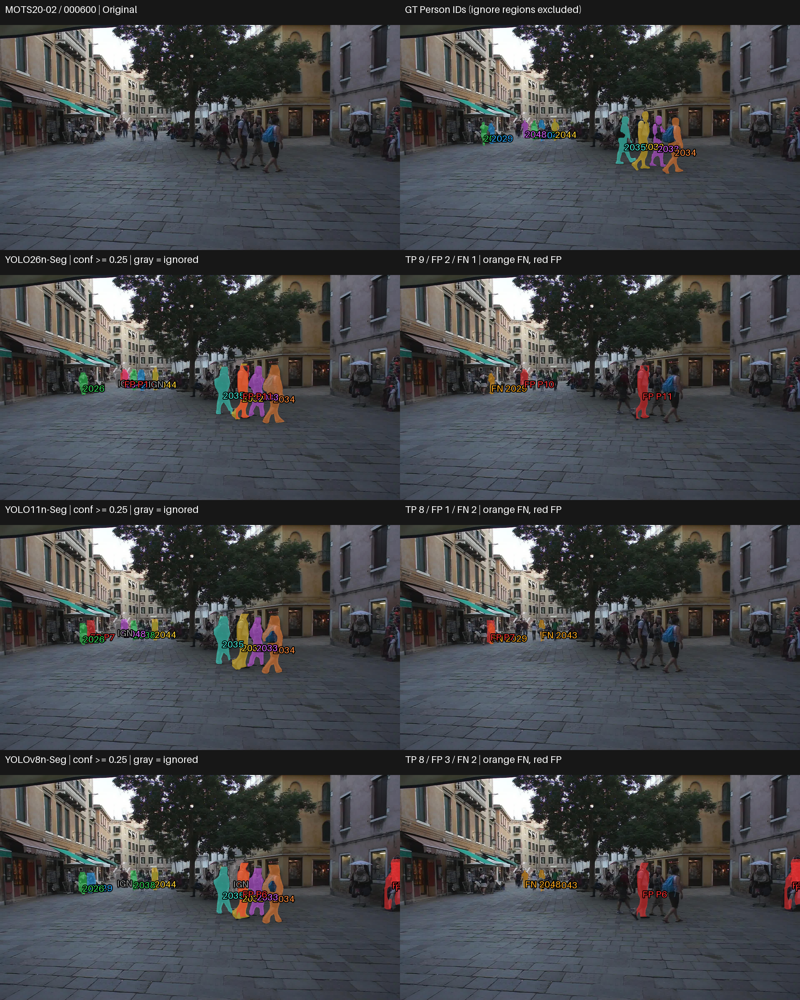

# Nano (N) — Visual and Qualitative Analysis

## 1. ภาพรวมผลการทดลอง

Nano ทดสอบครบ 3 pretrained models บน MOTS20 2,862 เฟรม / 26,894 Person GT instances โดยไม่ fine-tune และใช้ frozen protocol เดิม เอกสารนี้อ่านพฤติกรรมจาก prediction จริง; ผลเชิงตัวเลขเต็มอยู่ที่ [RESULTS_SUMMARY_TH.md](RESULTS_SUMMARY_TH.md)

| Model | Mask mAP50-95 | AP75 | Recall |
|---|---|---|---|
| YOLO26n-Seg | 0.472698 | 0.506766 | 0.687068 |
| YOLO11n-Seg | 0.431929 | 0.450826 | 0.693798 |
| YOLOv8n-Seg | 0.423062 | 0.439115 | 0.696921 |

## การเลือกกรณีและการอ่านภาพ

คัด 4 กรณีจาก 12 frozen visualization frames ด้วย per-frame TP/FP/FN/matched IoU แล้วตรวจภาพจริง เลือกข้อได้เปรียบ ข้อผิดพลาดร่วม กรณีสวนอันดับ accuracy และผลคล้ายกัน ไม่ใช่ representative sample รายละเอียดอยู่ใน [CASE_SELECTION.md](outputs/visualizations/qualitative/CASE_SELECTION.md)
ไม่มี comparison เดิม จึงสร้างจาก saved lossless RLE และ original/GT ไม่โหลดโมเดลและไม่รัน inference เพิ่ม

แถวแรก Original/GT; ต่อด้วย YOLO26, YOLO11, YOLOv8 ซ้าย prediction ขวา unmatched overlay ใช้ภาพเต็มเฟรมเดียวกันและ scale เท่ากัน สี matched mask ผูกกับ GT ID; สีส้ม FN สีแดง FP สีเทา IGN
ใช้ confidence ≥0.25, matching mask IoU ≥0.50 และ ignore IOA เดิม FN คือ GT ไม่มีคู่ผ่านเกณฑ์ จึงอาจมี detection ที่ mask ไม่ผ่าน IoU; FP คือ prediction ไม่ match valid GT และไม่ถูก ignore จึงอาจอยู่บนคนจริง GT panel แสดง Person; IGN ไม่ถูกนับ FP ตัวเลขตรวจตรงกับ per-frame CSV

## Case 1 — เก็บ Person เพิ่ม แต่ยังมี unmatched masks

เหตุผลที่เลือก: ข้อได้เปรียบของ accuracy leader พร้อม error ที่เหลือ · MOTS20-02 / 000600

### ภาพเปรียบเทียบ

### สิ่งที่เห็นจากภาพ

- YOLO26n match 9 instances เทียบกับอีกสองโมเดล 8; GT 2043 ในกลุ่มคนตัวเล็กฝั่งซ้ายถูก match เฉพาะ YOLO26n
- YOLO26n/YOLO11n มี FN ของ GT 2029 แต่ YOLOv8n match ได้; YOLOv8n มี FN ของ GT 2048 ที่อีกสองโมเดล match ได้
- FP ของ YOLO26n/YOLO11n/YOLOv8n คือ 2/1/3 ตามลำดับ รวม mask แดงบนคนใหญ่ด้านหน้าใน YOLO26n/YOLOv8n และบริเวณคนตัวเล็กฝั่งซ้าย

### วิเคราะห์

ทั้งสามเก็บคนใหญ่ด้านหน้าได้หลาย instance แต่ความต่างการผ่าน matching อยู่ที่คนตัวเล็กด้วย YOLO26n ได้ TP เพิ่มโดยไม่ได้ชนะทุก GT และไม่ได้มี FP ต่ำสุด Mask แดงบนคนใหญ่ไม่ควรถูกเรียกว่าคนที่ไม่มีจริง เพราะเป็น unmatched prediction ตามเกณฑ์ benchmark

### เชื่อมกับผลเชิงตัวเลข

แม้ YOLO26n มี Recall รวมต่ำสุด แต่เฟรมนี้มี TP สูงสุด จึงเป็น counterexample ต่อการขยายอันดับรวมเป็นทุกเฟรม คุณภาพ matched mask ที่สูงกว่าเป็นข้อมูลอีกด้าน ไม่ใช่หลักฐานว่าเก็บ GT ครบที่สุดเสมอ Mean matched-mask IoU ของเฟรม: YOLO26n-Seg 0.667000; YOLO11n-Seg 0.651768; YOLOv8n-Seg 0.627628; เฉลี่ยจาก GT ที่ match ซึ่งอาจคนละชุด ไม่ใช่การวัดขอบของคนเดียวกันโดยตรง

## Case 2 — ข้อผิดพลาดร่วมในกลุ่มคนกลางภาพ

เหตุผลที่เลือก: แสดง common failure ไม่เลือกเฉพาะเฟรมที่ตัวนำชนะ · MOTS20-09 / 000263

### ภาพเปรียบเทียบ

### สิ่งที่เห็นจากภาพ

- ทุกโมเดลมี TP 7 / FN 6 และ FN ของ GT ชุดเดียวกัน: 2001, 2002, 2007, 2011, 2018, 2023
- บริเวณกลุ่มคนกลางภาพมีพื้นที่ FN ขนาดเล็กระหว่างคน และมี FP สีแดงบนบริเวณคนจริง รวม FP 3/4/3 สำหรับ YOLO26n/YOLO11n/YOLOv8n
- คนใหญ่ด้านซ้ายถูก match ในทุกโมเดล แต่การมี prediction กลางภาพไม่ทำให้ทุก GT ตรงบริเวณนั้นผ่าน matching

### วิเคราะห์

จำนวน TP เท่ากันไม่ได้แปลว่าไม่มีข้อจำกัด ทั้งสามพลาด GT ร่วมกันหก instance และมี prediction ที่ไม่ผ่าน valid-GT matching การดูเฉพาะ mask ใหญ่ด้านหน้าจะมองไม่เห็นข้อผิดพลาดเหล่านี้ ไม่ระบุระดับความรุนแรงของ occlusion หรือสาเหตุเชิง architecture

### เชื่อมกับผลเชิงตัวเลข

ตัวนำ mAP/AP75 ยังมี error ร่วมกับโมเดลอื่น ตัวอย่างนี้ช่วยแยกการเก็บ instance กับ overlap ของคู่ที่ match แต่ไม่ให้ความถี่ failure ทั้ง dataset Mean matched-mask IoU ของเฟรม: YOLO26n-Seg 0.852839; YOLO11n-Seg 0.826521; YOLOv8n-Seg 0.829330; เฉลี่ยจาก GT ที่ match ซึ่งอาจคนละชุด ไม่ใช่การวัดขอบของคนเดียวกันโดยตรง

## Case 3 — Recall มากขึ้นพร้อม FP เพิ่ม

เหตุผลที่เลือก: สวนอันดับ mAP และแสดง precision–recall trade-off · MOTS20-02 / 000300

### ภาพเปรียบเทียบ

### สิ่งที่เห็นจากภาพ

- YOLO26n/YOLO11n/YOLOv8n match 6/7/8 instances และมี FP 1/2/4 ตามลำดับ
- GT 2040 ด้านหลังคู่คนใหญ่กลางภาพถูก match ใน YOLO11n/YOLOv8n แต่เป็น FN ใน YOLO26n; GT 2026 ฝั่งซ้ายถูก match เฉพาะ YOLOv8n
- ทุกโมเดลมี FN ของ GT 2003/2027/2028/2029; YOLOv8n มี mask แดงเพิ่มบริเวณคนฝั่งซ้ายและริมขวา ขณะที่ YOLO11n มี mask แดงบนคนใหญ่ทางขวา

### วิเคราะห์

YOLOv8n เก็บ valid GT เพิ่มสอง instance เมื่อเทียบกับ YOLO26n แต่มี unmatched predictions มากกว่า จึงไม่สรุปว่ารุ่นที่ TP มากกว่าชนะทุกด้าน คนใหญ่กลางภาพดูใกล้กัน แต่ instance ด้านหลังและทางซ้ายเปลี่ยนความครบถ้วนของเฟรม

### เชื่อมกับผลเชิงตัวเลข

ทิศทางนี้สอดคล้องกับ Recall รวมสูงสุดของ YOLOv8n 0.696921 พร้อม Precision ต่ำสุด 0.826411 เทียบกับ YOLO26n Recall 0.687068 / Precision 0.901850 อย่างไรก็ตามเฟรมเดียวไม่อธิบายช่องว่างรวม และ Case 1 แสดงทิศทาง TP ตรงข้าม Mean matched-mask IoU ของเฟรม: YOLO26n-Seg 0.814921; YOLO11n-Seg 0.733120; YOLOv8n-Seg 0.733461; เฉลี่ยจาก GT ที่ match ซึ่งอาจคนละชุด ไม่ใช่การวัดขอบของคนเดียวกันโดยตรง

## Case 4 — เก็บ valid GT ครบ แต่ extra mask ต่างกัน

เหตุผลที่เลือก: ผลคล้ายกันและตรวจคู่ที่ mAP ใกล้ที่สุด · MOTS20-09 / 000001

### ภาพเปรียบเทียบ

### สิ่งที่เห็นจากภาพ

- ทุกโมเดล match valid GT ครบ 6 instances ไม่มี FN รวมคนใหญ่ริมภาพและ Person ตัวเล็กหน้าร้าน
- YOLO11n ไม่มี FP; YOLO26n มี FP หนึ่ง mask ในฉากหลังร้านฝั่งซ้าย ซึ่งไม่ทับ valid GT Person
- YOLOv8n มี FP สอง masks ใกล้คนใหญ่ฝั่งขวา บริเวณเดียวกับ prediction ที่ match คนนี้แล้ว จึงมี unmatched masks เพิ่มแม้ Recall ของเฟรมเต็ม

### วิเคราะห์

ภาพ valid Person โดยรวมคล้ายกัน แต่ข้อผิดพลาดเพิ่มอยู่คนละตำแหน่ง YOLO11n/YOLOv8n มี TP เท่ากันแต่ FP ต่างกัน จึงไม่ใช่พฤติกรรมเหมือนกันทั้งหมด การมี extra mask ใกล้คนจริงยังไม่เพียงพอจะวินิจฉัย instance merging หรือ fragmentation

### เชื่อมกับผลเชิงตัวเลข

YOLO11n มี mAP รวมสูงกว่า YOLOv8n และเฟรมนี้มี FP น้อยกว่า แต่ไม่สรุปความถี่ error จากกรณีเดียว Recall รวมของ YOLOv8n ที่สูงกว่าไม่สร้างความต่างด้าน FN ในเฟรมนี้ Mean matched-mask IoU ของเฟรม: YOLO26n-Seg 0.749901; YOLO11n-Seg 0.706538; YOLOv8n-Seg 0.672066; เฉลี่ยจาก GT ที่ match ซึ่งอาจคนละชุด ไม่ใช่การวัดขอบของคนเดียวกันโดยตรง

## Failure Analysis

| Failure pattern | Models observed | Visual case | Interpretation |
|---|---|---|---|
| Unmatched Person ตัวเล็ก | ทุกโมเดล แต่พลาด GT ต่างกัน | Case 1/3 | ขนาดเล็กในภาพจริง; FN อาจรวม mask ที่ไม่ผ่าน IoU |
| Unmatched GT ในกลุ่มคนกลางภาพ | ทุกโมเดล GT 2001/2002/2007/2011/2018/2023 | Case 2 | ข้อผิดพลาดร่วม ไม่อนุมานสาเหตุหรือความถี่ทั้ง dataset |
| Unmatched mask บนหรือใกล้คนจริง | ทุกโมเดลใน Case 2; YOLOv8n ใน Case 4 | Case 2/4 | FP ตาม matching/ignore policy ไม่จำเป็นต้องเป็นคนที่ไม่มีจริง |
| Extra mask ในฉากหลังร้าน | YOLO26n | Case 4 | FP เฉพาะตัวอย่าง ไม่สรุป background robustness |

นับได้เฉพาะเฟรมที่มีหลักฐาน ตัวอย่างเหล่านี้ไม่ให้ dataset-wide frequency และยังไม่พอระบุ boundary leakage, instance merging หรือ fragmentation

## Near-tie visual check

YOLO11n/YOLOv8n เป็นคู่ที่ mAP ใกล้ที่สุดใน Nano: 0.431929/0.423062 ต่าง 0.008867 หรือประมาณ 0.887 percentage points ไม่ควรเรียกว่าเท่ากันหรือมีนัยสำคัญโดยไม่มีการทดสอบ Case 4 ทั้งคู่เก็บ valid GT ครบและ mask หลักดูคล้ายกัน แต่ YOLOv8n มี FP เพิ่ม ส่วน Case 3 YOLOv8n เก็บ GT 2026 เพิ่มพร้อม FP มากกว่า จึงเห็น error trade-off ที่ต่างกัน
Pipeline 97.441/95.683 ms ใกล้กันเชิงพรรณนา แต่ภาพ segmentation ใช้ยืนยันความต่างด้านเวลาไม่ได้

## สิ่งที่เรียนรู้จากภาพจริง

### Observation 1

Case 1 YOLO26n เก็บ GT 2043 เพิ่ม แต่ยังพลาด GT 2029 ที่ YOLOv8n match ได้

**Interpretation:** ตัวนำ mAP อาจเก็บบาง instance เพิ่มโดยไม่ชนะทุก instance; Recall รวมไม่กำหนดอันดับทุกเฟรม

### Observation 2

Case 2 ทั้งสามมี FN ชุดเดียวกันหก instance และ FP บนบริเวณคนจริง

**Interpretation:** ต้องตรวจ GT/matching ร่วมกับ prediction การมองว่ามี mask แล้วไม่ได้รับรองความครบถ้วน

### Observation 3

Case 3 YOLOv8n มี TP มากกว่า YOLO26n สอง instance และ FP มากกว่าสาม masks

**Interpretation:** ตัวอย่างนี้สอดคล้องกับ Recall สูง/Precision ต่ำของ YOLOv8n แต่ไม่พิสูจน์ว่า trade-off เกิดทุกเฟรม

### Observation 4

Case 4 valid GT ถูก match ครบทุกโมเดล แต่ FP ของแต่ละโมเดลต่างจำนวนและตำแหน่ง

**Interpretation:** คะแนนหรือผลหลักคล้ายกันอาจซ่อน error ต่างชนิด ควรตรวจฉากหลังและ unmatched regions ร่วมด้วย

## เมื่อดูทั้งตัวเลขและภาพร่วมกัน

YOLO26n นำ mAP/AP75 และ TP-only quality แต่มี Recall ต่ำสุด Case 3 ช่วยเห็นการเก็บ instance เพิ่มของ YOLOv8n พร้อม FP เพิ่ม ส่วน Case 1 มี TP อันดับกลับกัน ภาพจึงช่วยตีความความต่างระหว่างคุณภาพ mask กับความครบถ้วน โดยไม่ให้เหตุผลเชิงสาเหตุของ AP ทั้ง dataset AP ใช้ confidence ranking และหลาย IoU thresholds ต่างจากภาพที่ confidence 0.25/matching 0.50

Latency และ VRAM เป็น system-level measurements อ่านจาก benchmark; ภาพ segmentation ไม่สามารถวัดหรืออธิบายสองค่านี้ได้ YOLOv8n forward เร็วสุด แต่ YOLO26n pipeline เร็วสุด และ YOLO11n VRAM ต่ำสุด Pipeline FPS ไม่รวม RLE preparation และ disk I/O

## ถ้าพิจารณาทั้งผลเชิงตัวเลขและภาพ

| Priority | Candidate | Evidence |
|---|---|---|
| Accuracy | YOLO26n-Seg | mAP/AP75/TP-only quality สูงสุด; Case 1 แสดง matched instance เพิ่ม แต่ Case 2/3 แสดงข้อจำกัด |
| Speed | YOLOv8n-Seg (inference); YOLO26n-Seg (pipeline) | Clean timing 9.045 ms forward / 82.390 ms pipeline ตามลำดับ; ภาพไม่วัดเวลา |
| Low VRAM | YOLO11n-Seg | Peak allocated 1030.00 MiB จาก memory benchmark; ภาพไม่วัด memory |
| Balanced | YOLO26n-Seg หากเน้น mAP และ pipeline; YOLOv8n-Seg หากเน้น Recall/forward | ไม่มีผู้ชนะทุกด้าน Case 1/3 แสดง trade-off ที่ต้องอ่านร่วมกับ benchmark และข้อจำกัดการใช้งาน |

ไม่ใช้ weighted score และไม่สรุป final CCTV superiority; ยังไม่ได้ทำ final cross-tier synthesis

## ข้อจำกัด

- Selected frames เป็นตัวอย่างเชิงคุณภาพจาก pool 12 เฟรม ไม่แทน dataset-level metrics และไม่ใช่ representative sample
- เลือกทั้งข้อได้เปรียบ common failure กรณีสวนอันดับ และผลคล้ายกันเพื่อลด cherry-picking แต่ไม่รับรองครอบคลุมทุก error
- MOTS20 ไม่ใช่ final CCTV robustness test ไม่อนุมาน blur/low light/มุมกล้องหรือระดับ occlusion
- Qualitative observations และ numerical near ties ไม่ใช่ statistical significance
- ภาพย่อและ overlay อาจบังรายละเอียดขอบ การวิเคราะห์ระดับพิกเซลต้องกลับไปตรวจ RLE ไม่อ้างสาเหตุจาก architecture

## รายละเอียดเต็ม

[Quantitative summary](RESULTS_SUMMARY_TH.md) · [REPORT.md](REPORT.md) · [TIER_RESULTS.csv](metrics/TIER_RESULTS.csv) · [Case evidence](outputs/visualizations/qualitative/CASE_EVIDENCE.json) · [Master Study](https://github.com/folklazy/YOLO_Instance_Segmentation_MOTS20_Scaling_Study)
